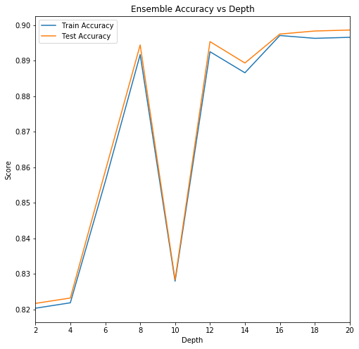
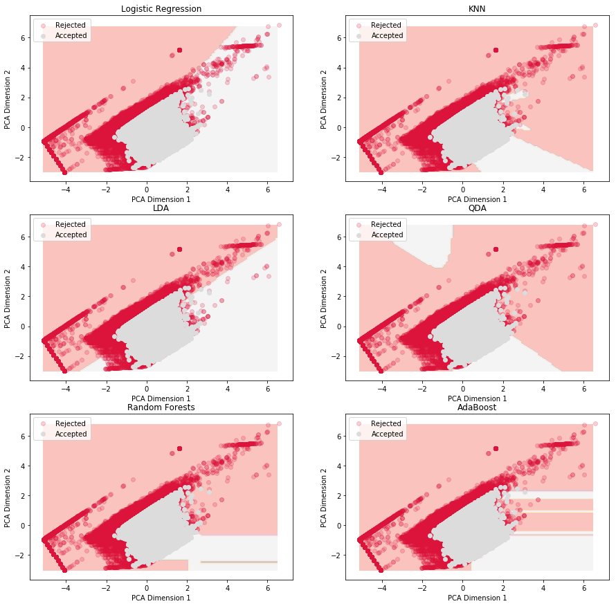

# 1.3 Machine Learning

## Building Binary Classifiers

#### 0.......Preparing the data
#### I........Principal Component Analysis
#### II.......FICO score vs. Log of Debt to Income Ratio
#### III......Predictability of Zip Code Data
#### IV......LDA, QDA, & K-NN
#### V.......Boosting with Adaboost
#### VI......Decision Boundaries with Principal Components
#### VII.....Stacking 
#### VIII....Final Results


```python
from sklearn.linear_model import LogisticRegression
from sklearn.model_selection import train_test_split
from sklearn.metrics import roc_auc_score
from sklearn.metrics import accuracy_score
from sklearn.metrics import classification_report
from sklearn.metrics import confusion_matrix

from sklearn.decomposition import PCA
from sklearn.linear_model import LinearRegression
from sklearn.linear_model import LogisticRegressionCV
from sklearn.discriminant_analysis import LinearDiscriminantAnalysis
from sklearn.discriminant_analysis import QuadraticDiscriminantAnalysis
from sklearn.preprocessing import PolynomialFeatures
from sklearn.neighbors import KNeighborsClassifier
from sklearn.model_selection import cross_val_score
from sklearn.model_selection import KFold
from sklearn import preprocessing
from sklearn.utils import resample
from sklearn.ensemble import RandomForestClassifier
from sklearn.ensemble import AdaBoostClassifier
from sklearn.tree import DecisionTreeClassifier
```

***The data was previously read in and prepared.***

#### Split the full data into train, tune, and test sets. 


```python
loan_training, loan_tune = train_test_split(both_cats, test_size=.2)
loan_train, loan_test = train_test_split(loan_training, test_size=.25)
```


```python
X_train = loan_train.iloc[:, loan_train.columns != 'accepted']
y_train = loan_train['accepted']

X_test = loan_test.iloc[:, loan_test.columns != 'accepted']
y_test = loan_test['accepted']

X_tune = loan_tune.iloc[:, loan_tune.columns != 'accepted']
y_tune = loan_tune['accepted']
```


```python
print(X_train.shape)
print(X_test.shape)
print(X_tune.shape)
```

    (857174, 970)
    (285725, 970)
    (285725, 970)


#### Standardize the numeric columns.


```python
columns = ['emp_length', 'FICO score', 'log_DtIR']
std_Scaler = preprocessing.StandardScaler()
std_Scaler.fit(X_train[columns])
X_train[columns] = pd.DataFrame(std_Scaler.transform(X_train[columns]))
X_test[columns] = pd.DataFrame(std_Scaler.transform(X_test[columns]))
X_tune[columns] = pd.DataFrame(std_Scaler.transform(X_tune[columns]))

X_train.head()
```

    /Users/danngo/anaconda/lib/python3.6/site-packages/pandas/core/frame.py:3137: SettingWithCopyWarning: 
    A value is trying to be set on a copy of a slice from a DataFrame.
    Try using .loc[row_indexer,col_indexer] = value instead
    
    See the caveats in the documentation: http://pandas.pydata.org/pandas-docs/stable/indexing.html#indexing-view-versus-copy
      self[k1] = value[k2]


<div>
<style scoped>
    .dataframe tbody tr th:only-of-type {
        vertical-align: middle;
    }

    .dataframe tbody tr th {
        vertical-align: top;
    }

    .dataframe thead th {
        text-align: right;
    }
</style>
<table border="1" class="dataframe">
  <thead>
    <tr style="text-align: right;">
      <th></th>
      <th>emp_length</th>
      <th>FICO score</th>
      <th>log_DtIR</th>
      <th>001xx</th>
      <th>006xx</th>
      <th>007xx</th>
      <th>008xx</th>
      <th>009xx</th>
      <th>010xx</th>
      <th>011xx</th>
      <th>...</th>
      <th>990xx</th>
      <th>991xx</th>
      <th>992xx</th>
      <th>993xx</th>
      <th>994xx</th>
      <th>995xx</th>
      <th>996xx</th>
      <th>997xx</th>
      <th>998xx</th>
      <th>999xx</th>
    </tr>
  </thead>
  <tbody>
    <tr>
      <th>342016</th>
      <td>0.839174</td>
      <td>0.194870</td>
      <td>0.106306</td>
      <td>0</td>
      <td>0</td>
      <td>0</td>
      <td>0</td>
      <td>0</td>
      <td>0</td>
      <td>0</td>
      <td>...</td>
      <td>0</td>
      <td>0</td>
      <td>0</td>
      <td>0</td>
      <td>0</td>
      <td>0</td>
      <td>0</td>
      <td>0</td>
      <td>0</td>
      <td>0</td>
    </tr>
    <tr>
      <th>27576</th>
      <td>1.098798</td>
      <td>0.377778</td>
      <td>0.833561</td>
      <td>0</td>
      <td>0</td>
      <td>0</td>
      <td>0</td>
      <td>0</td>
      <td>0</td>
      <td>0</td>
      <td>...</td>
      <td>0</td>
      <td>0</td>
      <td>0</td>
      <td>0</td>
      <td>0</td>
      <td>0</td>
      <td>0</td>
      <td>0</td>
      <td>0</td>
      <td>0</td>
    </tr>
    <tr>
      <th>12184</th>
      <td>-0.848384</td>
      <td>0.063176</td>
      <td>0.520537</td>
      <td>0</td>
      <td>0</td>
      <td>0</td>
      <td>0</td>
      <td>0</td>
      <td>0</td>
      <td>0</td>
      <td>...</td>
      <td>0</td>
      <td>0</td>
      <td>0</td>
      <td>0</td>
      <td>0</td>
      <td>0</td>
      <td>0</td>
      <td>0</td>
      <td>0</td>
      <td>0</td>
    </tr>
    <tr>
      <th>58747</th>
      <td>1.618047</td>
      <td>0.121707</td>
      <td>0.460805</td>
      <td>0</td>
      <td>0</td>
      <td>0</td>
      <td>0</td>
      <td>0</td>
      <td>0</td>
      <td>0</td>
      <td>...</td>
      <td>0</td>
      <td>0</td>
      <td>0</td>
      <td>0</td>
      <td>0</td>
      <td>0</td>
      <td>0</td>
      <td>0</td>
      <td>0</td>
      <td>0</td>
    </tr>
    <tr>
      <th>90839</th>
      <td>1.618047</td>
      <td>0.268033</td>
      <td>-0.197956</td>
      <td>0</td>
      <td>0</td>
      <td>0</td>
      <td>0</td>
      <td>0</td>
      <td>0</td>
      <td>0</td>
      <td>...</td>
      <td>0</td>
      <td>0</td>
      <td>0</td>
      <td>0</td>
      <td>0</td>
      <td>0</td>
      <td>0</td>
      <td>0</td>
      <td>0</td>
      <td>0</td>
    </tr>
  </tbody>
</table>
<p>5 rows × 970 columns</p>
</div>


```python
X_tune[columns].describe()
```


<div>
<style scoped>
    .dataframe tbody tr th:only-of-type {
        vertical-align: middle;
    }

    .dataframe tbody tr th {
        vertical-align: top;
    }

    .dataframe thead th {
        text-align: right;
    }
</style>
<table border="1" class="dataframe">
  <thead>
    <tr style="text-align: right;">
      <th></th>
      <th>emp_length</th>
      <th>FICO score</th>
      <th>log_DtIR</th>
    </tr>
  </thead>
  <tbody>
    <tr>
      <th>count</th>
      <td>193828.000000</td>
      <td>193828.000000</td>
      <td>193828.000000</td>
    </tr>
    <tr>
      <th>mean</th>
      <td>0.003933</td>
      <td>-0.001031</td>
      <td>-0.000818</td>
    </tr>
    <tr>
      <th>std</th>
      <td>1.002293</td>
      <td>1.005494</td>
      <td>1.001182</td>
    </tr>
    <tr>
      <th>min</th>
      <td>-0.848384</td>
      <td>-4.721695</td>
      <td>-2.577269</td>
    </tr>
    <tr>
      <th>25%</th>
      <td>-0.848384</td>
      <td>-0.017303</td>
      <td>-0.395402</td>
    </tr>
    <tr>
      <th>50%</th>
      <td>-0.458947</td>
      <td>0.231452</td>
      <td>0.170780</td>
    </tr>
    <tr>
      <th>75%</th>
      <td>1.098798</td>
      <td>0.421676</td>
      <td>0.594864</td>
    </tr>
    <tr>
      <th>max</th>
      <td>1.618047</td>
      <td>1.497175</td>
      <td>10.946181</td>
    </tr>
  </tbody>
</table>
</div>


#### Eliminate any rows that may have null values after standardization.


```python
X_test = X_test.dropna(axis=0)
X_tune = X_tune.dropna(axis=0)
```


```python
print(X_test.shape)
print(X_tune.shape)
```

    (193759, 970)
    (193828, 970)


#### We still have an equal number of accepted and rejected loans represented. Good!


```python
y_test = y_test.iloc[X_test.index]
y_tune = y_tune.iloc[X_tune.index]
```


```python
print(y_test.value_counts())
print(y_tune.value_counts())
```

    0    97545
    1    96214
    Name: accepted, dtype: int64
    0    97446
    1    96382
    Name: accepted, dtype: int64


#### Since using over 850,000 rows of data may take longer when training multiple models, we will use a random sample of 200,000 to allow for faster computation. 


```python
X_train_subset = resample(X_train, n_samples=200000, replace=False)
X_train_subset.shape
```


    (200000, 970)


```python
loan_train_subset = loan_train.iloc[X_train_subset.index, :]
y_train_subset = y_train.iloc[X_train_subset.index]
loan_train_subset.shape
```


    (200000, 971)


#### There is still a near equal amount of accepted and rejected loans represented. 


```python
y_train_subset.value_counts()
```


    0    100996
    1     99004
    Name: accepted, dtype: int64


### I. Principal Component Analysis


```python
pca_transformer = PCA(2).fit(X_train_subset)
x_train_2d = pca_transformer.transform(X_train_subset)
x_train_2d[0:5,:]
```


    array([[ 0.3323023 ,  1.27102005],
           [ 1.08371017,  1.76681162],
           [ 1.23757997,  2.7350153 ],
           [-0.36951315, -0.09357616],
           [-0.50455971,  0.6930745 ]])


```python
colors = ['orange','blue']
label_text = ['Rejected', 'Accepted']
alphas = [1, 0.1]

fig = plt.figure(figsize = (12,6))
# and we loop over the different groups
for i in [0, 1]:
    category_df = x_train_2d[loan_train_subset['accepted'] == i]
    plt.scatter(category_df[:,0], category_df[:,1], 
                c = colors[i], alpha = alphas[i],
                marker='.', label = label_text[i])
    
# all plots need labels
plt.xlabel("PCA Dimension 1")
plt.ylabel("PCA Dimention 2")
plt.grid(b=False)
plt.legend(loc='best')
plt.show()
```


```python
var_explained = pca_transformer.explained_variance_ratio_
print("Variance explained by each PCA component:", var_explained)
print("Total Variance Explained:", np.sum(var_explained))
```

    Variance explained by each PCA component: [ 0.38821371  0.23140268]
    Total Variance Explained: 0.619616389005


#### The top 2 principal components explain 62% of the total variance. Considering there are over 900 columns of zip code data, what if we eliminated all of the zip code columns to see how much variation just employment length, FICO score, and the log of debt-to-income ratio can explain? Maybe the zip code data is just extra noise and the true signal lies within the numerical columns. 

#### Without zip code data:


```python
pca_transformer = PCA(2).fit(X_train_subset[columns])
x_train_2d = pca_transformer.transform(X_train_subset[columns])
x_train_2d[0:5,:]
```


    array([[ 0.33244568,  1.27092406],
           [ 1.08369198,  1.76691194],
           [ 1.23763042,  2.73501775],
           [-0.36964207, -0.09344522],
           [-0.50456561,  0.69301589]])


```python
fig = plt.figure(figsize = (12,6))
# and we loop over the different groups
for i in [0, 1]:
    category_df = x_train_2d[loan_train_subset['accepted'] == i]
    plt.scatter(category_df[:,0], category_df[:,1], 
                c = colors[i], alpha = alphas[i],
                marker='.', label = label_text[i])
    
# all plots need labels
plt.xlabel("PCA Dimension 1")
plt.ylabel("PCA Dimention 2")
plt.grid(b=False)
plt.legend(loc='best')
plt.show()
```


```python
var_explained = pca_transformer.explained_variance_ratio_
print("Variance explained by each PCA component:", var_explained)
print("Total Variance Explained:", np.sum(var_explained))
```

    Variance explained by each PCA component: [ 0.51607881  0.3076186 ]
    Total Variance Explained: 0.823697403644


#### Amazing! Without the all the zip code data, the top 2 principal components now can explain 82% of the variation. That's 20% higher than when including all the zip code data. 

### II. FICO score vs. Log of Debt to Income Ratio

#### A look at where accepted and rejected loans lie on the plot with FICO score and the log of debt-to-income ratio:


```python
#responses = sorted(loan_train.accepted.unique())
colors = ['orange','blue']
label_text = ['Rejected', 'Accepted']
alphas = [0.3, 0.1]
plt.figure(figsize = (8,6))

for i in [0, 1]:
    msk = loan_train['accepted'] == i 
    plt.scatter(loan_train['log_DtIR'][msk], 
                loan_train['FICO score'][msk], 
                c = colors[i], marker='.',
                label = label_text[i],
                alpha= alphas[i])
    
plt.legend(loc='best')
plt.title('FICO vs. Log of Debt to Income Ratio')
plt.xlabel('Log DtIR')
plt.ylabel('FICO score')
plt.show()
```


#### As shown above, accepted applicants lie in the upper left, where they tend to have higher FICO scores and much less debt. 


```python
# function to print accuracy results of a classifier
def print_model_results(model, X_test, y_test, auc_dict, acc_dict, sens_dict, spec_dict, model_name):
    labels = model.predict(X_test)
    predictions = pd.Series(labels)

    auc_score = roc_auc_score(y_test, predictions)
    auc_dict[model_name] =  auc_score
    #print('auc score: ', auc_score)
    #print()
    acc_score = accuracy_score(y_test, predictions)
    acc_dict[model_name] = acc_score
    #print('accuracy_score: ', acc_score)
    #print()
    tn, fp, fn, tp = confusion_matrix(y_test, 
                                      predictions).ravel()
    sensitivity = tp / (fn+tp)
    specificity = tn / (fp+tn)
    sens_dict[model_name] = sensitivity
    spec_dict[model_name] = specificity
    #print('sensitivity: ', sensitivity)
    #print('specificity: ', specificity)
    #print()
    print(classification_report(y_test, predictions))
    
auc_dict, acc_dict, sens_dict, spec_dict = {}, {}, {}, {}
```

### Binary Classification: 

*Building classifiers to predict whether a loan application will be accepted or rejected*

#### Our models use common data we have discovered- 'emp_length', 'FICO score', 'log_DtIR', from every loan application and sees if it can predict whether the loan was rejected or not. Train and test splits are used. The log of Debt-To-Income Ratio is used since the original data is so heavily skewed with a right tail and had a wide range. The first 3 digits of zip codes are also used. There are over 900 different three-digit zip codes and each of these are one-hot-encoded into dummy variables, as you saw before. Data on the state of residence is the last common data column within the two separate accepted and rejected loan datasets. This data has since been removed from our model predictors because it is redundant, considering we already have three-digit zip code data. 

#### For full transparency, our previous plans stated that more sophisticated versions of of our models will use text data, where each common word in the descriptions or application have their own binary column and the appearance of those words will be help the binary classifier make its predictions. It turns out that the text data in the accepted loan datasets and the text data in the rejected loan datasets are not similar to one another. The text data in the accepted loan datasets features employment title, application title, purpose for loans, and added sentences of comments within the application. NONE of this information is in the dataset among rejected loans. The rejected loan datasets have a "loan title" column and most of that text data is just 3-4 words that is mostly just user names. Since both accepted and rejected datasets do NOT have similar text data, we can not incorporate text data into our binary classifier. There would be plenty of text data for accepted loans but little text data on rejected loans. It is best to use common data from both data types of datasets.

### III. The Predictability of Zip Code Data

#### To begin, we'll look to see if zip code data has any predictive power, using logistic regression and random forests:


```python
# with zip code data
logistic_model = LogisticRegression(C=1000000)
logistic_model.fit(X_train_subset, y_train_subset)
```


    LogisticRegression(C=1000000, class_weight=None, dual=False,
              fit_intercept=True, intercept_scaling=1, max_iter=100,
              multi_class='ovr', n_jobs=1, penalty='l2', random_state=None,
              solver='liblinear', tol=0.0001, verbose=0, warm_start=False)


```python
logr_model_score = logistic_model.score(X_test, y_test)
print('test set accuracy: ', logr_model_score)
```

    test set accuracy:  0.806357382109


#### Now try with just the columns- 'emp_length', 'FICO score', 'log_DtIR'. In other words, eliminate the zip code data and see how accuracy changes:


```python
logistic_model2 = LogisticRegressionCV(solver = 'saga', cv = 5)
logistic_model2.fit(X_train_subset[columns], y_train_subset)
```


    LogisticRegressionCV(Cs=10, class_weight=None, cv=5, dual=False,
               fit_intercept=True, intercept_scaling=1.0, max_iter=100,
               multi_class='ovr', n_jobs=1, penalty='l2', random_state=None,
               refit=True, scoring=None, solver='saga', tol=0.0001, verbose=0)


```python
print_model_results(logistic_model2, X_test[columns], y_test, auc_dict, acc_dict, sens_dict, spec_dict, 'logistic reg')
```

                 precision    recall  f1-score   support
    
              0       0.79      0.85      0.82     97545
              1       0.83      0.77      0.80     96214
    
    avg / total       0.81      0.81      0.81    193759
    


#### When we eliminate all the zip code data, accuracy is almost exactly the same! Let's try this comparison again using random forests, instead of logistic regression:


```python
train_scores, test_scores = [], []
for d in range(2, 21, 2):
    # with all predictors, including zip code data
    fitted_rf = RandomForestClassifier(n_estimators=20, max_depth=d).fit(X_train_subset, y_train_subset)
    train_score = fitted_rf.score(X_train_subset, y_train_subset)
    test_score = fitted_rf.score(X_test, y_test)
    train_scores.append(train_score)
    test_scores.append(test_score)
```


```python
fig, ax = plt.subplots(1,1, figsize=(8,8))
ax.plot(list(range(2, 21, 2)), train_scores, label="Train Accuracy")
ax.plot(list(range(2, 21, 2)), test_scores, label="Test Accuracy")
ax.set_xlabel("Depth")
ax.set_ylabel("Score")
ax.set_title("Ensemble Accuracy vs Depth")
ax.legend(loc="best")
ax.set_xlim(2, 20)
plt.show()
```





```python
# with all predictors, including zip code data
# get specific results
fitted_rf = RandomForestClassifier(n_estimators=20, max_depth=8).fit(X_train_subset, y_train_subset)
rf_test_score = fitted_rf.score(X_test, y_test)
print('test set accuracy: ', rf_test_score)
```

    test set accuracy:  0.895426793078


#### Now eliminate the zip code data:


```python
train_scores, test_scores = [], []
for d in range(2, 21, 2):
    # without zip code data, only 3 predictors
    fitted_rf = RandomForestClassifier(n_estimators=20, max_depth=d).fit(X_train_subset[columns], y_train_subset)
    train_score = fitted_rf.score(X_train_subset[columns], y_train_subset)
    test_score = fitted_rf.score(X_test[columns], y_test)
    train_scores.append(train_score)
    test_scores.append(test_score)
```


```python
fig, ax = plt.subplots(1,1, figsize=(8,8))
ax.plot(list(range(2, 21, 2)), train_scores, label="Train Accuracy")
ax.plot(list(range(2, 21, 2)), test_scores, label="Test Accuracy")
ax.set_xlabel("Depth")
ax.set_ylabel("Score")
ax.set_title("Ensemble Accuracy vs Depth")
ax.legend(loc="best")
ax.set_xlim(2, 20)
plt.show()
```


```python
# without zip code data, only 3 predictors
fitted_rf2 = RandomForestClassifier(n_estimators=20, max_depth=5).fit(X_train_subset[columns], y_train_subset)
print_model_results(fitted_rf2, X_test[columns], y_test, auc_dict, acc_dict, sens_dict, spec_dict, 'random forests')
```

                 precision    recall  f1-score   support
    
              0       0.92      0.89      0.90     97545
              1       0.89      0.92      0.90     96214
    
    avg / total       0.90      0.90      0.90    193759
    


#### Similar to that of logistic regression, the accuracy of the random forest model is similar when removing the zip code data. In fact, for random forests, accuracy actually increased when using only the 3 columns- 'emp_length', 'FICO score', 'log_DtIR'. This would suggest the zip code data does not lead to an increase in predictive power. 

#### For the sake of a simpler model (and even higher accuracy) with shorter computation time, we will eliminate the zip code data (it's over 900 extra columns) from future models and work with just the three numerical columns as the predictors for accepted loan / rejected loan. These three variables have substantial predictive power. Using logistic regression, we get 80% accuracy. Using random forests, we get 90% accuracy. 

### IV. LDA, QDA, & K-NN

#### Fit models for Linear Discriminant Analysis, Quadratic Discriminant Analysis, and K-Nearest Neighbors.


```python
lda = LinearDiscriminantAnalysis()
qda = QuadraticDiscriminantAnalysis()

lda.fit(X_train_subset[columns], y_train_subset)
#print('lda is good')
qda.fit(X_train_subset[columns], y_train_subset)
#print('qda is good')

max_score = 0
max_k = 0 

for k in range(2,26):
    knn = KNeighborsClassifier(n_neighbors = k)
    score = cross_val_score(knn,X_train_subset[columns], y_train_subset).mean()
    if score > max_score:
        max_k = k
        max_score = score

knn = KNeighborsClassifier(n_neighbors = max_k)
knn.fit(X_train_subset[columns], y_train_subset)

print('best k: ', max_k)
print('best k score: ', max_score)
```

    best k:  3
    best k score:  0.902949985431


#### Linear Discriminant Analysis results:


```python
print_model_results(lda, X_test[columns], y_test, auc_dict, acc_dict, sens_dict, spec_dict, 'LDA')
```

                 precision    recall  f1-score   support
    
              0       0.74      0.88      0.80     97545
              1       0.85      0.69      0.76     96214
    
    avg / total       0.79      0.78      0.78    193759
    


#### Quadratic Discriminant Analysis results:


```python
print_model_results(qda, X_test[columns], y_test, auc_dict, acc_dict, sens_dict, spec_dict, 'QDA')
```

                 precision    recall  f1-score   support
    
              0       0.92      0.68      0.78     97545
              1       0.74      0.94      0.83     96214
    
    avg / total       0.83      0.81      0.81    193759
    


#### K-Nearest Neighbors results:


```python
print_model_results(knn, X_test[columns], y_test, auc_dict, acc_dict, sens_dict, spec_dict, 'KNN')
```

                 precision    recall  f1-score   support
    
              0       0.93      0.86      0.89     97545
              1       0.87      0.94      0.90     96214
    
    avg / total       0.90      0.90      0.90    193759
    


### V. Boosting with AdaBoost


```python
depth_scores_train, depth_scores_test = [], []
for d in range(5, 11):
    ada = AdaBoostClassifier(base_estimator = \
                             DecisionTreeClassifier(max_depth=d), 
                             n_estimators=100, learning_rate=0.05)
    ada.fit(X_train_subset[columns], y_train_subset)
    ada_dscores_train = list(ada.staged_score(X_train_subset[columns], y_train_subset))
    ada_dscores_test = list(ada.staged_score(X_test[columns], y_test))
    
    depth_scores_train.append(ada_dscores_train)
    depth_scores_test.append(ada_dscores_test)
```


```python
fig, ax = plt.subplots(1,2, figsize=(18,6))
#train_colors = ['powderblue', 'skyblue', 'deepskyblue', 'steelblue']
depth_colors = ['mediumturquoise', 'mediumaquamarine', 
                'mediumseagreen', 'green', 'saddlebrown', 'black']
#train_colors = ['yellow', gold', 'orange', 'red', 'maroon', 'black']
for i in [10,9,8,7,6,5]:
    ax[0].plot(list(range(1,101)), depth_scores_train[i-5], 
            color = depth_colors[i-5], 
            label = "Depth {}, Train Accuracy".format(i))

ax[0].set_xlabel("Number of estimators")
ax[0].set_ylabel("Score")
ax[0].legend(loc="lower right")
ax[0].set_title("Ensemble Accuracy vs Iterations (Train set)")
ax[0].set_ylim(0.89, 1)

for i in [10,9,8,7,6,5]:
    ax[1].plot(list(range(1,101)), depth_scores_test[i-5], 
            color = depth_colors[i-5], 
            label = "Depth {}, Test Accuracy".format(i))

ax[1].set_xlabel("Number of estimators")
ax[1].set_ylabel("Score")
ax[1].legend(loc="lower right")
ax[1].set_title("Ensemble Accuracy vs Iterations (Test set)")
ax[1].set_ylim(0.89, 1)
plt.show()
```


#### With boosting, we get our highest test set accuracy! The Adaboost classifier can predict whether a loan will be accepted or rejected with up to 96% accuracy:


```python
# get specific results
ada = AdaBoostClassifier(base_estimator = \
                             DecisionTreeClassifier(max_depth=8), 
                             n_estimators=20, learning_rate=0.05)
ada.fit(X_train_subset[columns], y_train_subset)

print_model_results(ada, X_test[columns], y_test, auc_dict, acc_dict, sens_dict, spec_dict, 'AdaBoost')
```

                 precision    recall  f1-score   support
    
              0       0.97      0.96      0.96     97545
              1       0.96      0.97      0.96     96214
    
    avg / total       0.96      0.96      0.96    193759
    


#### When it comes to the accuracy of all 6 models,

#### AdaBoost > random forests > KNN > QDA > logistic regression > LDA.

#### A full comparison is shown at the end.

### VI. Decision Boundaries with Principal Components

#### Fitting all 6 models - but this time - using the top 2 principal components:


```python
logistic_modelPCA = LogisticRegressionCV(solver = 'saga', cv = 5).fit(x_train_2d, y_train_subset)
knn_pca = KNeighborsClassifier(n_neighbors = max_k).fit(x_train_2d, y_train_subset)
lda_pca = LinearDiscriminantAnalysis().fit(x_train_2d, y_train_subset)
qda_pca = QuadraticDiscriminantAnalysis().fit(x_train_2d, y_train_subset)
rf_pca = RandomForestClassifier(n_estimators=20, max_depth=8).fit(x_train_2d, y_train_subset)

ada_pca = AdaBoostClassifier(base_estimator = \
                             DecisionTreeClassifier(max_depth=8), 
                             n_estimators=20, learning_rate=0.05)
ada_pca.fit(x_train_2d, y_train_subset)

```


    AdaBoostClassifier(algorithm='SAMME.R',
              base_estimator=DecisionTreeClassifier(class_weight=None, criterion='gini', max_depth=8,
                max_features=None, max_leaf_nodes=None,
                min_impurity_decrease=0.0, min_impurity_split=None,
                min_samples_leaf=1, min_samples_split=2,
                min_weight_fraction_leaf=0.0, presort=False, random_state=None,
                splitter='best'),
              learning_rate=0.05, n_estimators=20, random_state=None)


```python
# Borrowed from the homework
#--------  plot_decision_boundary
# A function that visualizes the data and the decision boundaries
# Input: 
#      x (predictors)
#      y (labels)
#      model (the classifier you want to visualize)
#      title (title for plot)
#      ax (a set of axes to plot on)
#      poly_degree (highest degree of polynomial terms included in the model; None by default)

def plot_decision_boundary(x, y, model, title, ax, poly_degree=None):
    # Create mesh
    # Interval of points for biomarker 1
    min0 = x[:,0].min()
    max0 = x[:,0].max()
    interval0 = np.arange(min0, max0, (max0-min0)/100)
    n0 = np.size(interval0)
    
    # Interval of points for biomarker 2
    min1 = x[:,1].min()
    max1 = x[:,1].max()
    interval1 = np.arange(min1, max1, (max1-min1)/100)
    n1 = np.size(interval1)

    # Create mesh grid of points
    x1, x2 = np.meshgrid(interval0, interval1)
    x1 = x1.reshape(-1,1)
    x2 = x2.reshape(-1,1)
    xx = np.concatenate((x1, x2), axis=1)

    # Predict on mesh of points
    # Check if polynomial terms need to be included
    if(poly_degree!=None):
        # Use PolynomialFeatures to generate polynomial terms
        poly = PolynomialFeatures(poly_degree,include_bias = False)
        xx_ = poly.fit_transform(xx)
        yy = model.predict(xx_) 
        
    else:   
        yy = model.predict(xx)
    
    yy = yy.reshape((n0, n1))

    # Plot decision surface
    x1 = x1.reshape(n0, n1)
    x2 = x2.reshape(n0, n1)
    ax.contourf(x1, x2, yy, cmap=plt.cm.Pastel1, alpha=0.8)
    
    # Plot scatter plot of data
    yy = y.reshape(-1,)
    #ax.scatter(x[yy==1,0], x[yy==1,1], c='blue', label='Normal', cmap=plt.cm.coolwarm)
    ax.scatter(x[yy==0,0], x[yy==0,1], c='crimson', label='Rejected', cmap=plt.cm.Pastel1, alpha=0.2)
    ax.scatter(x[yy==1,0], x[yy==1,1], c='gainsboro', label='Accepted', cmap=plt.cm.Pastel1, alpha=1)
    
    # Label axis, title
    ax.set_title(title)
    ax.set_xlabel('PCA Dimension 1')
    ax.set_ylabel('PCA Dimension 2')
    ax.legend(loc='best')
```

#### Visualizing the decision boundary for accepted and rejected loan applicants, based on the top 2 principal components:


```python
fitted_models = [logistic_modelPCA, 
                 knn_pca, lda_pca, qda_pca, 
                 rf_pca, ada_pca]
                 
titles = ['Logistic Regression',           
          'KNN','LDA','QDA',
          'Random Forests', 'AdaBoost']

f, axes = plt.subplots(3, 2, figsize = (15,15))
c = 0 
for i in range(len(axes)):
    for j in range(len(axes[0])):
        mod = fitted_models[c]
               
            
        plot_decision_boundary(x_train_2d, y_train_subset.values, 
                               mod, titles[c], axes[i,j])
        c += 1
        
        if c == len(fitted_models):
            break

```





#### As shown above, the decision boundaries for the two linear classifiers - logistic regression and LDA - had linear separators that gave the accepted class more territory. K-NN, QDA, random forests, and AdaBoost, all in their own way via specific methods had smaller decision boundaries for the accepted class. The accepted class is concentrated in a small area based on the two principal components.

### VII. Stacking

#### Now we will look to combine the results of each model (predictions are made on the tune set and test set) and train those predictions with a new meta-model. This is called stacking (or meta ensembling): a model ensembling technique used to combine information from multiple predictive models to generate a new model.


```python
model_dict = {'logistic reg': logistic_model2,
             'random forests': fitted_rf2,
             'LDA': lda, 'QDA': qda, 
             'KNN': knn, 'AdaBoost': ada}

ensemble_tune, ensemble_test = pd.DataFrame(), pd.DataFrame()
for m in model_dict:
    model_tune_preds = model_dict[m].predict(X_tune[columns])
    print('predicted {} good'.format(m))
    model_test_preds = model_dict[m].predict(X_test[columns])
    print('predicted {} good'.format(m))
    col_name = "{} predictions".format(m)
    ensemble_tune[col_name] = pd.Series(model_tune_preds)
    ensemble_test[col_name] = pd.Series(model_test_preds)
```

    predicted logistic reg good
    predicted logistic reg good
    predicted random forests good
    predicted random forests good
    predicted LDA good
    predicted LDA good
    predicted QDA good
    predicted QDA good
    predicted KNN good
    predicted KNN good
    predicted AdaBoost good
    predicted AdaBoost good


```python
ensemble_tune.head()
```


<div>
<style scoped>
    .dataframe tbody tr th:only-of-type {
        vertical-align: middle;
    }

    .dataframe tbody tr th {
        vertical-align: top;
    }

    .dataframe thead th {
        text-align: right;
    }
</style>
<table border="1" class="dataframe">
  <thead>
    <tr style="text-align: right;">
      <th></th>
      <th>logistic reg predictions</th>
      <th>random forests predictions</th>
      <th>LDA predictions</th>
      <th>QDA predictions</th>
      <th>KNN predictions</th>
      <th>AdaBoost predictions</th>
    </tr>
  </thead>
  <tbody>
    <tr>
      <th>0</th>
      <td>0</td>
      <td>0</td>
      <td>0</td>
      <td>0</td>
      <td>0</td>
      <td>0</td>
    </tr>
    <tr>
      <th>1</th>
      <td>1</td>
      <td>0</td>
      <td>1</td>
      <td>1</td>
      <td>0</td>
      <td>0</td>
    </tr>
    <tr>
      <th>2</th>
      <td>1</td>
      <td>1</td>
      <td>1</td>
      <td>1</td>
      <td>1</td>
      <td>1</td>
    </tr>
    <tr>
      <th>3</th>
      <td>1</td>
      <td>1</td>
      <td>1</td>
      <td>1</td>
      <td>0</td>
      <td>1</td>
    </tr>
    <tr>
      <th>4</th>
      <td>0</td>
      <td>0</td>
      <td>0</td>
      <td>1</td>
      <td>1</td>
      <td>1</td>
    </tr>
  </tbody>
</table>
</div>


```python
ensemble_test.head()
```


<div>
<style scoped>
    .dataframe tbody tr th:only-of-type {
        vertical-align: middle;
    }

    .dataframe tbody tr th {
        vertical-align: top;
    }

    .dataframe thead th {
        text-align: right;
    }
</style>
<table border="1" class="dataframe">
  <thead>
    <tr style="text-align: right;">
      <th></th>
      <th>logistic reg predictions</th>
      <th>random forests predictions</th>
      <th>LDA predictions</th>
      <th>QDA predictions</th>
      <th>KNN predictions</th>
      <th>AdaBoost predictions</th>
    </tr>
  </thead>
  <tbody>
    <tr>
      <th>0</th>
      <td>0</td>
      <td>1</td>
      <td>0</td>
      <td>1</td>
      <td>1</td>
      <td>1</td>
    </tr>
    <tr>
      <th>1</th>
      <td>0</td>
      <td>1</td>
      <td>0</td>
      <td>1</td>
      <td>1</td>
      <td>1</td>
    </tr>
    <tr>
      <th>2</th>
      <td>0</td>
      <td>0</td>
      <td>0</td>
      <td>0</td>
      <td>0</td>
      <td>0</td>
    </tr>
    <tr>
      <th>3</th>
      <td>1</td>
      <td>1</td>
      <td>1</td>
      <td>1</td>
      <td>1</td>
      <td>1</td>
    </tr>
    <tr>
      <th>4</th>
      <td>1</td>
      <td>1</td>
      <td>1</td>
      <td>1</td>
      <td>1</td>
      <td>1</td>
    </tr>
  </tbody>
</table>
</div>


#### Our stacking model will use random forests to make its predictions:


```python
rfclf = RandomForestClassifier(n_estimators=20, max_depth=5)
rfclf.fit(ensemble_tune, y_tune)
feature_importances = rfclf.feature_importances_
```


```python
print_model_results(rfclf, ensemble_test, y_test, auc_dict, acc_dict, sens_dict, spec_dict, 'Stacking')
```

                 precision    recall  f1-score   support
    
              0       0.97      0.96      0.96     97545
              1       0.96      0.97      0.96     96214
    
    avg / total       0.96      0.96      0.96    193759
    


#### This model ensembling technique is tied with AdaBoost for the highest prediction accuracy. We are able to predict whether an applicant will be accepted for a loan or denied for a loan with up to 96% accuracy!

#### Here are the feature importances for this stacking implementation via random forests:


```python
pd.Series(feature_importances, 
          index=ensemble_test.columns).sort_values().plot(kind="barh", 
                                                          color='forestgreen')
plt.show()
```


#### It seems the AdaBoost predictions had the greatest significance. The predictions for LDA had the least.

### VIII. Final Results

#### Finally, here are the performances of all 7 models, shown below:


```python
fig = plt.figure(figsize = (17,10))
    
ax1 = fig.add_subplot(2,2,1)
ax1 = pd.DataFrame.from_dict(auc_dict, orient='index')[0].sort_values().plot(kind="barh", 
                                                      color='limegreen')
#ax1.set_xlim(0, max_range)
ax1.set_title("Area Under Curve")

ax2 = fig.add_subplot(2,2,2)
ax2 = pd.DataFrame.from_dict(acc_dict, orient='index')[0].sort_values().plot(kind="barh", 
                                                      color='crimson')
#ax2.set_xlim(0, max_range)
ax2.set_title('Test Set Accuracy')

ax3 = fig.add_subplot(2,2,3)
ax3 = pd.DataFrame.from_dict(sens_dict, orient='index')[0].sort_values().plot(kind="barh", 
                                                      color='dodgerblue')
#ax3.set_xlim(0, max_range)
ax3.set_title('Sensitivity (True Positive Rate)')

ax4 = fig.add_subplot(2,2,4)
ax4 = pd.DataFrame.from_dict(spec_dict, orient='index')[0].sort_values().plot(kind="barh", 
                                                      color='orange')
#ax4.set_xlim(0, max_range)
ax4.set_title('Specificity (True Negative Rate)')

plt.show()
```


#### Boosting and stacking yields the best results, by all four measures- receiver operating characteristic's area under the curve (ROC AUC), total test set accuracy, test set sensitivity, and test set specificity. Random forests trails behind, although it does not do as well with predicting accepted loans (sensitivity). K-nearest neighbors ranks mostly in between the seven models in all four measures. The biggest disparity in performance between sensitivity and specificity comes from QDA. It is the third highest in sensitivity but last in specificity. Logistic regression, ranks near the bottom in all four measures. LDA, by and large, performs the worst, but it does perform better with predicing rejected loans (specificity). The linear models, in general, do not perform as well as the others. This suggests the relationship between our predictors and our response is not linear, and that a linear separator of the data is not the most effective. 

#### Overall, our models did better than we expected. We managed to have an accuracy of up to 96% when using just three predictors- FICO score, employment length, and the natural log of debt to income ratio. 
