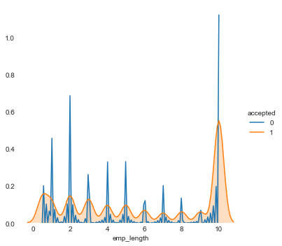

# Exploratory Data Analysis (EDA)

#### It appears FICO scores are bimodal for loans that are rejected. For loans that are accepted, it appears FICO scores are above a certain threshold- over 600. This could useful information for our model.


```python
sns.set_style('white')
g1 = sns.FacetGrid(both_cats, hue= 'accepted', size=5)
g1.map(sns.kdeplot, 'FICO score', shade= True).add_legend()
sns.despine(bottom= True, left= True)
plt.show()
```


#### The distribution of the log of "Debt-To-Income Ratio" for accepted loans is narrower. Rejected loans tend to have applicants with a wider range of debt-to-income ratios. Originally, we created this same plot with the regular "Debt-To-Income Ratio" column but the plot was practically nonexistent and inscrutable. The range was so wide that and the distribution was way too skewed. That's why the log of the column is used instead.


```python
g = sns.FacetGrid(both_cats, hue= 'accepted', size=5)
g.map(sns.kdeplot, 'log_DtIR', shade= True).add_legend()
sns.despine(bottom= True, left= True)
plt.show()
```


#### It appears accepted loans come more from those who work 10+ years (10+ in the dataset was re-coded to a numeric 10 for easier computation). Those who have less working experience are more likely to be rejected for loans. A variable that could correlate with this years of employment variable is age. The older you are, the more years you will work. However, age is not a column in the dataset. So there will be no issue of collinearity.


```python
g = sns.FacetGrid(both_cats, hue= 'accepted', size=5)
g.map(sns.kdeplot, 'emp_length', shade= True).add_legend()
sns.despine(bottom= True, left= True)
plt.show()
```





```python
fig = plt.figure(figsize = (10,17))
    
ax1 = fig.add_subplot(4,1,1)
ax1 = sns.violinplot(x = both_cats['accepted'], y = both_cats['log_DtIR'])
#ax1.set_xlim(0, max_range)
ax1.set_title('Log of Debt-To-Income Ratio')

ax2 = fig.add_subplot(4,1,2)
ax2 = sns.violinplot(x = both_cats['accepted'], y = both_cats['FICO score'])
#ax1.set_xlim(0, max_range)
ax2.set_title('FICO score')

ax3 = fig.add_subplot(4,1,3)
ax3 = sns.violinplot(x = both_cats['accepted'], y = both_cats['emp_length'])
#ax1.set_xlim(0, max_range)
ax3.set_title('Employment Length')
```


    Text(0.5,1,'Employment Length')


#### From the 3 plots above, we can see that 

**1.** The log of Debt-To-Income Ratio has a narrower distribution for accepted loans.

**2.** FICO scores for accepted applications are above a certain threshold.

**3.** Years of employment tends to vary among the accepted loans and rejected loans. For accepted, there are more people who worked 10+ years. For rejected, there are more people who worked for less than 2 years.

#### In fact, among each classified employment length, we can see how the log of Debt-To-Income Ratio and FICO score are distributed. Those with rejected loans tended to have much wider distributions for each:


```python
sns.violinplot(x=both_cats['emp_length'],y=both_cats['log_DtIR'], 
               hue=both_cats['accepted'])
plt.show()
```


```python
sns.violinplot(x=both_cats['emp_length'],y=both_cats['FICO score'], 
               hue=both_cats['accepted'])
plt.show()
```


#### Below are some scatter plots of how FICO score, the natural log of debt to income ratio, and employment length all relate: 


```python
plt.scatter(both_cats['log_DtIR'], both_cats['FICO score'], marker='.', color = 'purple')
plt.title('FICO score vs. Log of Debt to Income Ratio')
plt.xlabel('Log of Debt to Income Ratio')
plt.ylabel('FICO score')
plt.show()
```


```python
plt.scatter(both_cats['emp_length'], both_cats['FICO score'], marker='.', color = 'purple')
plt.title('FICO score vs. Years of Employment')
plt.xlabel('Years of Employment')
plt.ylabel('FICO score')
plt.show()
```


#### Years of employment could be a nice proxy for age (age data is not available in any of the datasets). As seen below, those who are younger are more likely to be in debt (e.g. college loans to pay off and newly entering the work force). Those who are older (10+ years of employment) are also more likely to be in debt (e.g. borrowing money to pay numerous expenses, bills, mortages, etc).


```python
plt.scatter(both_cats['emp_length'], both_cats['log_DtIR'], marker='.', color = 'purple')
plt.title('Log of Debt to Income Ratio vs. Years of Employment')
plt.xlabel('Years of Employment')
plt.ylabel('Log of Debt to Income Ratio')
plt.show()
```


#### Among the accepted loan applicants, the 10 most populated three-digit zip codes are of -

**1.** North Dallas, TX (750xx)

**2.** Brooklyn, NY (112xx)

**3.** Part of Oakland, CA (945xx)

**4.** Part of Chicago, IL (606xx)

**5.** East Atlanta, GA (300xx)

**6.** Part of Miami, FL (331xx)

**7.** Part of Newark, NJ (070xx)

**8.** Part of Houston, TX (770xx)

**9.** Part of Miami, FL (330xx)

**10.** Amityville, NY (117xx)


```python
acc_piece.zip_code.value_counts()
```


    750xx    7722
    112xx    7501
    945xx    7394
    606xx    6669
    300xx    6534
    331xx    6050
    070xx    5779
    770xx    5755
    330xx    5543
    117xx    5254
    891xx    5239
    104xx    5226
    100xx    5107
    900xx    5016
    917xx    4700
    852xx    4594
    925xx    4043
    601xx    4028
    334xx    4027
    604xx    3980
    913xx    3919
    926xx    3904
    921xx    3821
    853xx    3758
    600xx    3728
    481xx    3717
    080xx    3655
    760xx    3643
    773xx    3627
    113xx    3483
             ... 
    854xx       2
    702xx       2
    525xx       2
    348xx       2
    698xx       2
    569xx       2
    093xx       1
    964xx       1
    694xx       1
    515xx       1
    872xx       1
    009xx       1
    552xx       1
    202xx       1
    742xx       1
    663xx       1
    521xx       1
    523xx       1
    709xx       1
    510xx       1
    966xx       1
    007xx       1
    909xx       1
    055xx       1
    696xx       1
    343xx       1
    621xx       1
    203xx       1
    885xx       1
    528xx       1
    Name: zip_code, Length: 918, dtype: int64


#### Among the rejected loan applicants, the 10 most populated three-digit zip codes are of -

**1.** Part of Miami, FL (331xx)

**2.** Brooklyn, NY (112xx)

**3.** East Atlanta, GA (300xx)

**4.** Part of Chicago, IL (606xx)

**5.** Part of Oakland, CA (945xx)

**6.** Part of Los Angeles, CA (900xx)

**7.** North Dallas, TX (750xx)

**8.** Part of Houston, TX (770xx)

**9.** Part of Miami, FL (330xx)

**10.** Part of Newark, NJ (070xx)


```python
rej_piece.zip_code.value_counts()
```


    331xx    7513
    112xx    7412
    300xx    6814
    606xx    6754
    945xx    6215
    900xx    6170
    750xx    6140
    770xx    5992
    330xx    5860
    070xx    5339
    917xx    4922
    891xx    4909
    104xx    4645
    100xx    4620
    117xx    4490
    925xx    4152
    334xx    4140
    080xx    4084
    852xx    3980
    921xx    3965
    021xx    3926
    191xx    3854
    604xx    3822
    913xx    3724
    782xx    3612
    212xx    3570
    926xx    3560
    207xx    3468
    481xx    3462
    600xx    3349
             ... 
    399xx       2
    733xx       2
    888xx       2
    192xx       2
    533xx       2
    003xx       1
    663xx       1
    899xx       1
    709xx       1
    632xx       1
    419xx       1
    005xx       1
    659xx       1
    872xx       1
    715xx       1
    887xx       1
    642xx       1
    516xx       1
    771xx       1
    964xx       1
    649xx       1
    876xx       1
    692xx       1
    868xx       1
    909xx       1
    889xx       1
    588xx       1
    269xx       1
    055xx       1
    682xx       1
    Name: zip_code, Length: 971, dtype: int64


#### It is important to bear in mind that AT MOST, a three-digit zip code only represents 1% of the data. That is small. Nonetheless, 9 of the top 10 three-digit zip codes in the accepted loans dataset are also in the top 10 of the rejected loans dataset. In other words, the top 10 of both accepted and rejected share the same 9 three-digit zip codes. This would suggest that (a)- bigger cities have more applicants (that lead to both near-equal amounts of accepted and rejected), and (b)- there isn't much distinction in the most common three-digit zip codes among both datasets. 

#### It is hard to make conclusions about anything with this zip code column (other than the two that were stated above) because we are only given the first three digits of each zip code. We know that racial groups and socio-economic status tend to be segregated in more distinct areas within cities. However, we cannot identify what those areas are because that information would need to include the full five-digit zip code. We are only given three-digit zip codes (very general areas) and thus, it would be impossible to identify specific, smaller, segregated areas that are favored by LendingClub or are discriminated by LendingClub. 

#### The fact that LendingClub blocked out the final two digits so researchers could not prove regional discrimination may have been intentional. If they were concerned about privacy, then five-digit zip codes could easily have been encrypted with a secret key and then the encrypted zip codes still could have been released. In that way, we could still identify possible areas of discrimination without knowing what those areas actually are. Instead, we are left with three-digit zip codes that are not entirely useful since they cover very general areas. 


```python
from wordcloud import WordCloud
```


```python
acc_data = acc_data.dropna(axis=0)
```


```python
rej_data = rej_data.dropna(axis=0)
```

#### And lastly, shown below are word clouds of state residences in the dataset, as well as a word cloud of the job titles and a word cloud of the purpose for a loan. The larger the word, the larger the frequency!


```python
wordcloud1 = WordCloud().generate(' '.join(acc_data['addr_state']))
wordcloud2 = WordCloud().generate(' '.join(rej_data['State']))
wordcloud3 = WordCloud().generate(' '.join(acc_data['emp_title']))
wordcloud4 = WordCloud().generate(' '.join(acc_data['title']))

# Generate plot
f, ax = plt.subplots(4, 1, figsize=(10, 20))
ax[0].imshow(wordcloud1)
ax[0].axis("off")
ax[0].set_title("Popular States Among Accepted", fontsize=16)

ax[1].imshow(wordcloud2)
ax[1].axis("off")
ax[1].set_title("Popular States Among Rejected", fontsize=16)

ax[2].imshow(wordcloud3)
ax[2].axis("off")
ax[2].set_title("Job Title (data only available in accepted loans)", fontsize=16)

ax[3].imshow(wordcloud4)
ax[3].axis("off")
ax[3].set_title("Purpose (data only available in accepted loans)", fontsize=16)

plt.show()
```


#### We can see that New York, Texas, and California were the most frequent states of residence for both accepted loan applicants and rejected loan applicants. This can be due to the concentration of population in the United States rather than something specific about those states and the need for loans. More people live in those states, so we should expect those states to be represented more. Registered nurse, supervisor, teacher, director, vice president, office manager, and project manager all seem to be frequent job titles. Regarding purpose, most of it had to do with debt.

#### None of information shown in the word clouds will be incorporated in the model, but it is fun to explore anyway. The reason state residence will not be in the predictive model is because the model will already incorporate three-digit zip code data (thus state residence would be redundant). The reason job title and purpose for the loan will not be in the predictive model is because that information is only provided in the accepted loans dataset and not the rejected loans dataset. Only common columns from both datasets are used in the prediction models. 
