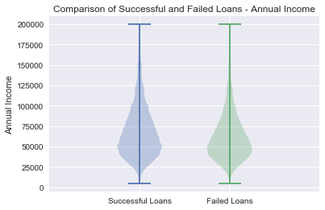
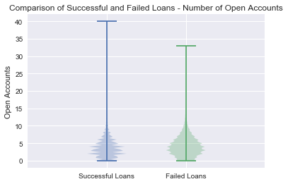
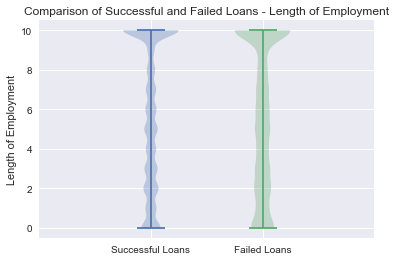
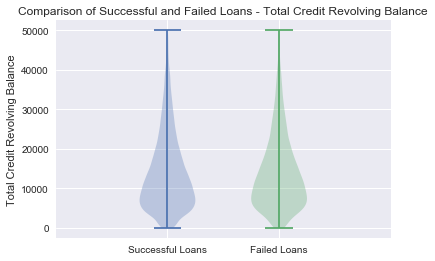
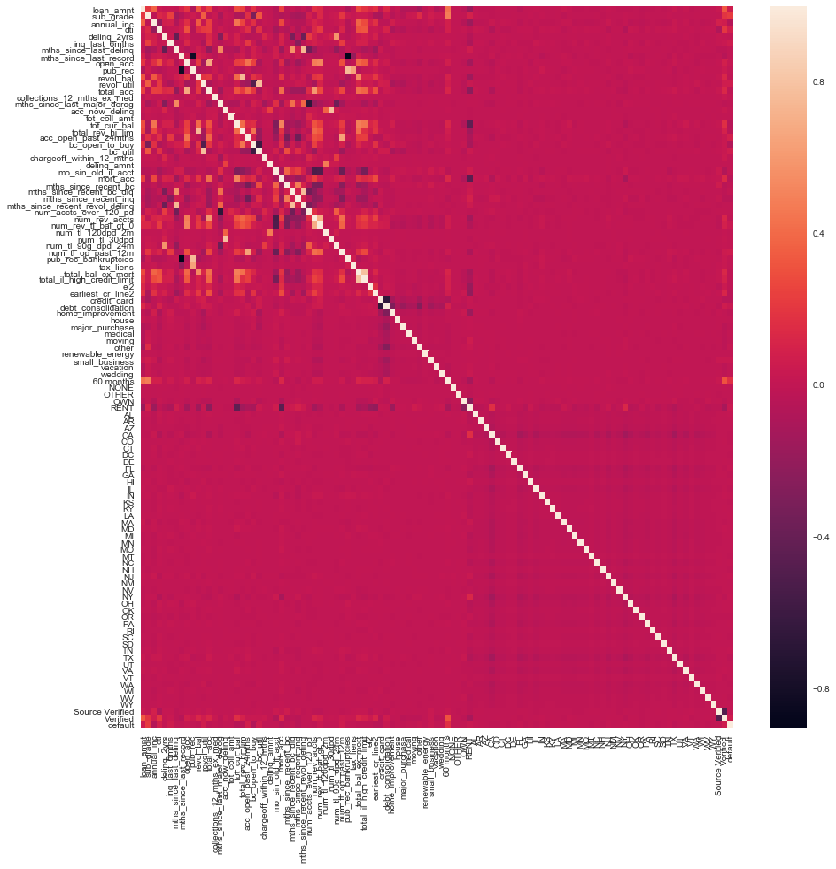
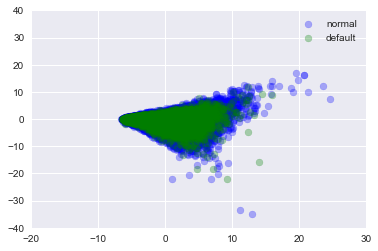

## Project Goal 2 - EDA


```python
import numpy as np
import pandas as pd

from sklearn.decomposition import PCA
from sklearn.model_selection import train_test_split
from sklearn import preprocessing

import matplotlib
import matplotlib.pyplot as plt
%matplotlib inline

import seaborn as sns
sns.set()
```


```python
import os
os.chdir("C:\\Users\\stuar\\OneDrive\\Documents\\cs109a\\project")
```


```python
final_df = pd.read_pickle("final_df.pkl")
```


```python
loan_success = final_df.loc[final_df['default'] == 0]
loan_failure = final_df.loc[final_df['default'] == 1]
```

## Some visualizations of the relationship of some of the variables to loan defaults


```python
# removing outliers for meaningful visualization
loan_s_trunc1 = loan_success.loc[loan_success['annual_inc'] < 200000]
loan_f_trunc1 = loan_failure.loc[loan_failure['annual_inc'] < 200000]

box_output = plt.violinplot(loan_s_trunc1['annual_inc'], positions=[0])
box_output = plt.violinplot(loan_f_trunc1['annual_inc'], positions=[1])

position_names = ['Successful Loans','Failed Loans']
plt.xticks(range(len(position_names)), position_names);
plt.xlim(-1,2)
    
plt.ylabel("Annual Income")
plt.title("Comparison of Successful and Failed Loans - Annual Income")
plt.show() 
```





```python
box_output = plt.violinplot(loan_success['acc_open_past_24mths'], positions=[0])
box_output = plt.violinplot(loan_failure['acc_open_past_24mths'], positions=[1])

position_names = ['Successful Loans','Failed Loans']
plt.xticks(range(len(position_names)), position_names);
plt.xlim(-1,2)
    
plt.ylabel("Open Accounts")
plt.title("Comparison of Successful and Failed Loans - Number of Open Accounts")
plt.show() 
```





```python
box_output = plt.violinplot(loan_success['el2'], positions=[0])
box_output = plt.violinplot(loan_failure['el2'], positions=[1])

position_names = ['Successful Loans','Failed Loans']
plt.xticks(range(len(position_names)), position_names);
plt.xlim(-1,2)
    
plt.ylabel("Length of Employment")
plt.title("Comparison of Successful and Failed Loans - Length of Employment")
plt.show() 
```





```python
loan_s_trunc2 = loan_success.loc[loan_success['revol_bal'] < 50000]
loan_f_trunc2 = loan_failure.loc[loan_failure['revol_bal'] < 50000]

cur_x_pos = 0
box_output = plt.violinplot(loan_s_trunc2['revol_bal'], positions=[0])
box_output = plt.violinplot(loan_f_trunc2['revol_bal'], positions=[1])

position_names = ['Successful Loans','Failed Loans']
plt.xticks(range(len(position_names)), position_names);
plt.xlim(-1,2)
    
plt.ylabel("Total Credit Revolving Balance")
plt.title("Comparison of Successful and Failed Loans - Total Credit Revolving Balance")
plt.show() 
```





## Checking for multicollinearity


```python
corr = final_df.corr()

plt.figure(figsize = (15,15))
sns.heatmap(corr, 
        xticklabels=corr.columns,
        yticklabels=corr.columns)
```


    <matplotlib.axes._subplots.AxesSubplot at 0x1dc2a433780>





```python
# have eliminated all combinations with correlation above 0.8
npcorr = np.corrcoef(final_df.values, rowvar=False)

x = np.where(npcorr > 0.8)

x0 = x[0]
x1 = x[1]

for i in range(len(x0)):
    if x0[i] != x1[i]:
        print("{0} -- {1}".format(x0[i],x1[i]))
```


```python
xdata = final_df.drop(['default'], axis = 1)
ydata = final_df['default']

# Split data to train and test sets
X_train, X_test, y_train, y_test = train_test_split(xdata, ydata, test_size=0.2, random_state=42)

print(X_train.shape)
print(X_test.shape)

# Normalize train data
scaler = preprocessing.StandardScaler().fit(X_train)
normalized_X_train = scaler.transform(X_train)   
normalized_X_test = scaler.transform(X_test)

```

    (147653, 106)
    (36914, 106)


## 2nd Principal Component vs. 1st Principal Component


```python
#PCA for visualization
pca_transformer = PCA(2).fit(normalized_X_train)
x_train_2d = pca_transformer.transform(normalized_X_train) 
train_2d = pd.DataFrame(x_train_2d, columns=['Z1','Z2'], index= y_train.index.values)  
train_2d['type'] = y_train
train_2d
plt.scatter(train_2d[train_2d['type']==0]['Z1'],train_2d[train_2d['type']==0]['Z2'], color = 'b', label = 'normal', alpha = 0.3)
plt.scatter(train_2d[train_2d['type']==1]['Z1'],train_2d[train_2d['type']==1]['Z2'], color = 'g', label = 'default', alpha = 0.3)
plt.xlim(-20,30)
plt.ylim(-40,40)

plt.legend()

var_explained = pca_transformer.explained_variance_ratio_
print("Variance explained by each PCA component:", var_explained)
print("Total Variance Explained:", np.sum(var_explained))
```

    Variance explained by each PCA component: [ 0.0557337  0.0339452]
    Total Variance Explained: 0.0896788960421




