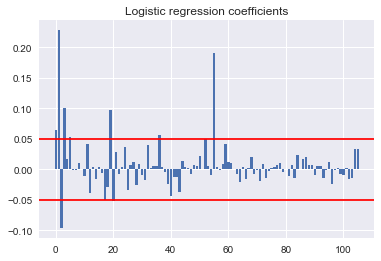

# 2.3 Machine Learning


```python
import numpy as np
import pandas as pd

import statsmodels.api as sm
from statsmodels.api import OLS

from sklearn.decomposition import PCA
from sklearn.linear_model import LogisticRegression
from sklearn.linear_model import LogisticRegressionCV
from sklearn.discriminant_analysis import LinearDiscriminantAnalysis
from sklearn.discriminant_analysis import QuadraticDiscriminantAnalysis
from sklearn.preprocessing import PolynomialFeatures
from sklearn.neighbors import KNeighborsClassifier
from sklearn.model_selection import cross_val_score
from sklearn.metrics import accuracy_score
from sklearn.model_selection import KFold
from sklearn.model_selection import train_test_split
from sklearn import preprocessing
from sklearn.ensemble import RandomForestClassifier
from sklearn.ensemble import AdaBoostClassifier
from sklearn.tree import DecisionTreeClassifier

from keras.models import Sequential
from keras.layers import Dense

import math
from scipy.special import gamma

import matplotlib
import matplotlib.pyplot as plt
%matplotlib inline

import seaborn as sns
sns.set()
```

    C:\Users\stuar\Anaconda3\lib\site-packages\statsmodels\compat\pandas.py:56: FutureWarning: The pandas.core.datetools module is deprecated and will be removed in a future version. Please use the pandas.tseries module instead.
      from pandas.core import datetools
    Using TensorFlow backend.


```python
import os
os.chdir("C:\\Users\\stuar\\OneDrive\\Documents\\cs109a\\project")

final_df = pd.read_pickle("final_df.pkl")
```


```python
xdata = final_df.drop(['default'], axis = 1)
ydata = final_df['default']

# Split data to train and test sets
X_train, X_test, y_train, y_test = train_test_split(xdata, ydata, test_size=0.2, random_state=42)

print(X_train.shape)
print(X_test.shape)

# Normalize train data
scaler = preprocessing.StandardScaler().fit(X_train)
normalized_X_train = scaler.transform(X_train)   
normalized_X_test = scaler.transform(X_test)
```

    (147653, 106)
    (36914, 106)


## Baseline model : Logistic Regression

#### statmodels regression is run on the non-standardized data as a diagnostic and to get a sense of variable performance


```python
X_train_c = sm.add_constant(X_train)

logit_model=sm.Logit(y_train,X_train_c)
logit_result=logit_model.fit()
print(logit_result.summary())
```

    Optimization terminated successfully.
             Current function value: 0.406130
             Iterations 7
                               Logit Regression Results                           
    ==============================================================================
    Dep. Variable:                default   No. Observations:               147653
    Model:                          Logit   Df Residuals:                   147546
    Method:                           MLE   Df Model:                          106
    Date:                Fri, 10 Aug 2018   Pseudo R-squ.:                 0.07632
    Time:                        11:20:40   Log-Likelihood:                -59966.
    converged:                       True   LL-Null:                       -64921.
                                            LLR p-value:                     0.000
    ==================================================================================================
                                         coef    std err          z      P>|z|      [0.025      0.975]
    --------------------------------------------------------------------------------------------------
    const                             -3.3419      0.196    -17.031      0.000      -3.726      -2.957
    loan_amnt                       1.489e-05   1.29e-06     11.524      0.000    1.24e-05    1.74e-05
    sub_grade                          0.0443      0.002     25.507      0.000       0.041       0.048
    annual_inc                     -4.795e-06    3.2e-07    -14.984      0.000   -5.42e-06   -4.17e-06
    dti                                0.0186      0.001     14.235      0.000       0.016       0.021
    delinq_2yrs                        0.0568      0.014      3.963      0.000       0.029       0.085
    inq_last_6mths                     0.0636      0.008      8.194      0.000       0.048       0.079
    mths_since_last_delinq         -1.383e-05   4.46e-05     -0.310      0.756      -0.000    7.36e-05
    mths_since_last_record          1.424e-05      0.000      0.098      0.922      -0.000       0.000
    open_acc                        -8.05e-05      0.003     -0.028      0.978      -0.006       0.006
    pub_rec                            0.0205      0.082      0.251      0.802      -0.140       0.181
    revol_bal                       1.635e-07   1.22e-06      0.134      0.894   -2.24e-06    2.56e-06
    revol_util                         0.0027      0.001      4.328      0.000       0.001       0.004
    total_acc                         -0.0097      0.001     -6.842      0.000      -0.013      -0.007
    collections_12_mths_ex_med         0.0993      0.119      0.835      0.404      -0.134       0.332
    mths_since_last_major_derog       -0.0002   5.37e-05     -3.571      0.000      -0.000   -8.65e-05
    acc_now_delinq                    -0.0023      0.230     -0.010      0.992      -0.453       0.448
    tot_coll_amt                   -1.104e-05   1.14e-05     -0.967      0.333   -3.34e-05    1.13e-05
    tot_cur_bal                    -1.998e-07   9.58e-08     -2.085      0.037   -3.88e-07    -1.2e-08
    total_rev_hi_lim               -2.356e-06   9.25e-07     -2.546      0.011   -4.17e-06   -5.42e-07
    acc_open_past_24mths               0.0613      0.004     15.269      0.000       0.053       0.069
    bc_open_to_buy                  -5.16e-06   1.29e-06     -4.004      0.000   -7.69e-06   -2.63e-06
    bc_util                           -0.0004      0.001     -0.760      0.447      -0.002       0.001
    chargeoff_within_12_mths          -0.1482      0.101     -1.469      0.142      -0.346       0.050
    delinq_amnt                     1.093e-05   1.42e-05      0.772      0.440   -1.68e-05    3.87e-05
    mo_sin_old_il_acct                 0.0004   5.99e-05      6.408      0.000       0.000       0.001
    mort_acc                          -0.0059      0.005     -1.165      0.244      -0.016       0.004
    mths_since_recent_bc               0.0004    8.3e-05      4.510      0.000       0.000       0.001
    mths_since_recent_bc_dlq        7.924e-05    5.5e-05      1.440      0.150   -2.86e-05       0.000
    mths_since_recent_inq             -0.0001   4.59e-05     -3.237      0.001      -0.000   -5.87e-05
    mths_since_recent_revol_delinq  5.917e-05   5.66e-05      1.045      0.296   -5.18e-05       0.000
    num_accts_ever_120_pd             -0.0269      0.012     -2.238      0.025      -0.050      -0.003
    num_rev_accts                      0.0005      0.002      0.273      0.785      -0.003       0.004
    num_rev_tl_bal_gt_0                0.0234      0.004      5.891      0.000       0.016       0.031
    num_tl_120dpd_2m                   0.0876      0.436      0.201      0.841      -0.767       0.942
    num_tl_30dpd                       0.2051      0.272      0.753      0.452      -0.329       0.739
    num_tl_90g_dpd_24m                 0.0019      0.029      0.066      0.947      -0.054       0.058
    num_tl_op_past_12m                 0.0355      0.007      5.187      0.000       0.022       0.049
    pub_rec_bankruptcies               0.0118      0.077      0.152      0.879      -0.139       0.163
    tax_liens                         -0.0426      0.084     -0.507      0.612      -0.207       0.122
    total_bal_ex_mort               6.621e-07   5.35e-07      1.238      0.216   -3.86e-07    1.71e-06
    total_il_high_credit_limit     -2.735e-06   5.35e-07     -5.116      0.000   -3.78e-06   -1.69e-06
    el2                               -0.0061      0.002     -2.926      0.003      -0.010      -0.002
    earliest_cr_line2               2.717e-05      0.000      0.265      0.791      -0.000       0.000
    credit_card                       -0.0107      0.085     -0.127      0.899      -0.176       0.155
    debt_consolidation                 0.1278      0.083      1.532      0.125      -0.036       0.291
    home_improvement                   0.1936      0.089      2.170      0.030       0.019       0.368
    house                              0.1455      0.129      1.131      0.258      -0.107       0.397
    major_purchase                     0.0707      0.101      0.701      0.483      -0.127       0.268
    medical                            0.2520      0.114      2.214      0.027       0.029       0.475
    moving                             0.2239      0.125      1.790      0.073      -0.021       0.469
    other                              0.2296      0.089      2.594      0.009       0.056       0.403
    renewable_energy                   0.1720      0.303      0.567      0.571      -0.423       0.766
    small_business                     0.7045      0.098      7.197      0.000       0.513       0.896
    vacation                           0.2486      0.131      1.895      0.058      -0.008       0.506
    wedding                           -0.0603      0.122     -0.495      0.620      -0.299       0.178
     60 months                         0.5959      0.022     26.863      0.000       0.552       0.639
    NONE                               0.4217      0.448      0.941      0.347      -0.457       1.300
    OTHER                             -0.0640      0.493     -0.130      0.897      -1.030       0.902
    OWN                                0.0530      0.029      1.813      0.070      -0.004       0.110
    RENT                               0.1383      0.021      6.695      0.000       0.098       0.179
    AL                                 0.4198      0.157      2.681      0.007       0.113       0.727
    AR                                 0.4696      0.164      2.856      0.004       0.147       0.792
    AZ                                 0.2809      0.152      1.846      0.065      -0.017       0.579
    CA                                 0.2607      0.145      1.796      0.072      -0.024       0.545
    CO                                 0.0406      0.154      0.263      0.792      -0.262       0.343
    CT                                 0.3353      0.156      2.152      0.031       0.030       0.641
    DC                                -0.1908      0.221     -0.863      0.388      -0.624       0.243
    DE                                 0.3273      0.205      1.601      0.109      -0.074       0.728
    FL                                 0.3895      0.146      2.660      0.008       0.102       0.677
    GA                                 0.2159      0.150      1.437      0.151      -0.079       0.510
    HI                                 0.2105      0.172      1.226      0.220      -0.126       0.547
    IL                                 0.1383      0.149      0.926      0.354      -0.154       0.431
    IN                                 0.3798      0.157      2.414      0.016       0.071       0.688
    KS                                 0.0304      0.165      0.184      0.854      -0.294       0.354
    KY                                 0.2484      0.164      1.518      0.129      -0.072       0.569
    LA                                 0.3049      0.158      1.926      0.054      -0.005       0.615
    MA                                 0.3294      0.152      2.169      0.030       0.032       0.627
    MD                                 0.3539      0.152      2.333      0.020       0.057       0.651
    MI                                 0.3781      0.151      2.500      0.012       0.082       0.674
    MN                                 0.2177      0.155      1.405      0.160      -0.086       0.521
    MO                                 0.2868      0.156      1.843      0.065      -0.018       0.592
    MT                                -0.0877      0.209     -0.419      0.675      -0.498       0.322
    NC                                 0.3206      0.150      2.138      0.033       0.027       0.615
    NH                                -0.0512      0.189     -0.272      0.786      -0.421       0.318
    NJ                                 0.4898      0.148      3.302      0.001       0.199       0.781
    NM                                 0.2656      0.176      1.512      0.131      -0.079       0.610
    NV                                 0.4797      0.155      3.103      0.002       0.177       0.783
    NY                                 0.3913      0.146      2.680      0.007       0.105       0.677
    OH                                 0.3300      0.150      2.206      0.027       0.037       0.623
    OK                                 0.3798      0.162      2.337      0.019       0.061       0.698
    OR                                 0.1394      0.159      0.878      0.380      -0.172       0.451
    PA                                 0.3159      0.149      2.117      0.034       0.023       0.608
    RI                                 0.4198      0.181      2.324      0.020       0.066       0.774
    SC                                 0.0331      0.162      0.204      0.838      -0.284       0.351
    SD                                 0.2068      0.217      0.954      0.340      -0.218       0.632
    TN                                 0.4287      0.158      2.705      0.007       0.118       0.739
    TX                                 0.1571      0.147      1.072      0.284      -0.130       0.444
    UT                                 0.2381      0.167      1.426      0.154      -0.089       0.565
    VA                                 0.3017      0.150      2.014      0.044       0.008       0.595
    VT                                -0.0162      0.249     -0.065      0.948      -0.505       0.472
    WA                                 0.1774      0.152      1.167      0.243      -0.120       0.475
    WI                                 0.2927      0.159      1.846      0.065      -0.018       0.603
    WV                                -0.1244      0.186     -0.668      0.504      -0.490       0.241
    WY                                -0.2259      0.225     -1.004      0.315      -0.667       0.215
    Source Verified                    0.1103      0.023      4.892      0.000       0.066       0.154
    Verified                           0.0171      0.021      0.818      0.414      -0.024       0.058
    ==================================================================================================


### Subsequent models are working with standardized data


```python
# Fit a logistic model with normalized data
fold = KFold(5, random_state=42, shuffle=True)

CV_object = LogisticRegressionCV(
    Cs=list(np.power(10.0, np.arange(-10, 10)))
    ,cv=fold
    ,random_state=777)

CV_object.fit(normalized_X_train, y_train) 
print("Best model searched:\nC = {}\nintercept = {}\nbetas = {}, ".format(CV_object.C_, CV_object.intercept_,CV_object.coef_))
print("training accuracy:", CV_object.score(normalized_X_train,y_train))
print("test accuracy:", CV_object.score(normalized_X_test,y_test))
```

    Best model searched:
    C = [ 0.0001]
    intercept = [-1.75929925]
    betas = [[ 0.06466723  0.22797465 -0.09623751  0.10079998  0.01629684  0.0536293
      -0.00106192 -0.00048354  0.01018212  0.00032315 -0.01096677  0.04068875
      -0.03860057  0.00414369 -0.01667543  0.00345208 -0.00685399 -0.05115014
      -0.02963636  0.097181   -0.05270162  0.02852177 -0.00790486  0.00320085
       0.03665313 -0.0335133   0.00653025  0.01227128 -0.02651006  0.0083323
      -0.00873236 -0.01735175  0.03994852  0.00132038  0.00546673  0.00503096
       0.05565013  0.00302361 -0.00512641 -0.02366232 -0.04411742 -0.01250739
      -0.01332294 -0.03779823  0.014221    0.00449256  0.00176374 -0.00718465
       0.00721631  0.00527539  0.02115272  0.00077151  0.05027032  0.0052343
      -0.00864742  0.19048837  0.00407318 -0.00103025  0.00854296  0.04182739
       0.01185985  0.0108419   0.00027588 -0.00815136 -0.02104895  0.00292474
      -0.01550641  0.0013318   0.01996541 -0.00699471 -0.00189161 -0.01890904
       0.0078155  -0.01516352 -0.00209539  0.00224791  0.00337952  0.0068641
       0.0096609  -0.00529045  0.00058566 -0.01174456  0.00619948 -0.01374244
       0.02417045 -0.00041644  0.01690927  0.01952724  0.00691675  0.00642214
      -0.01019054  0.0050451   0.00586238 -0.0148046  -0.00206096  0.01169887
      -0.02354843 -0.00204583  0.00278814 -0.00699705 -0.00915578  0.00140692
      -0.01681257 -0.0141337   0.03274878  0.03255554]], 
    training accuracy: 0.840179339397
    test accuracy: 0.839816871648


```python
for l in CV_object.coef_:
    for (column_name,c) in zip(X_train.columns,l):
        if np.abs(c) >= 0.05:
            print(column_name, c)
```

    loan_amnt 0.0646672344561
    sub_grade 0.227974653734
    annual_inc -0.0962375117283
    dti 0.100799982172
    inq_last_6mths 0.0536293030728
    tot_cur_bal -0.0511501439348
    acc_open_past_24mths 0.0971809970667
    bc_open_to_buy -0.052701618662
    num_tl_op_past_12m 0.0556501320537
    small_business 0.0502703233504
     60 months 0.190488366995


```python
# Visualization of coefficient values:
list_coeff = []
for l in CV_object.coef_:
    for c in l:
        list_coeff.append(c)
f, ax = plt.subplots()
ax.bar(range(len(list_coeff)),list_coeff)
ax.axhline(y=0.05, color='r', linestyle='-')
ax.axhline(y=-0.05, color='r', linestyle='-')
ax.set_title('Logistic regression coefficients')
```


    Text(0.5,1,'Logistic regression coefficients')





```python
for l in CV_object.coef_:
    for (column_name,c) in zip(X_train.columns,l):
        if np.abs(c) >= 0.05:
            print(column_name, c)
```

    loan_amnt 0.0646672344561
    sub_grade 0.227974653734
    annual_inc -0.0962375117283
    dti 0.100799982172
    inq_last_6mths 0.0536293030728
    tot_cur_bal -0.0511501439348
    acc_open_past_24mths 0.0971809970667
    bc_open_to_buy -0.052701618662
    num_tl_op_past_12m 0.0556501320537
    small_business 0.0502703233504
     60 months 0.190488366995


## Variable Selection

#### We found the significant predictors: coefficients whose p value is smaller than 2.5%. 
#### We can train a logistic regression model with the reduced set of input variables. The result shows that we get comparable test accuracy.


```python
# Get significant variables
significant_variables = list(logit_result.pvalues[logit_result.pvalues<=0.25].index)
significant_variables.remove('const')

# Run a logistic regression on the reduced input variable set that only contains significant variables (pvalue <= 2.5%)
reduced_x_train = X_train[significant_variables]
reduced_x_test = X_test[significant_variables]

reduced_scaler = preprocessing.StandardScaler().fit(reduced_x_train)
reduced_normalized_X_train = reduced_scaler.transform(reduced_x_train)   
reduced_normalized_X_test = reduced_scaler.transform(reduced_x_test)

Reduced_CV_object = LogisticRegressionCV(
    Cs=list(np.power(10.0, np.arange(-10, 10)))
    ,cv=fold
    ,random_state=777)

Reduced_CV_object.fit(reduced_normalized_X_train, y_train) 
print("Best model searched:\nC = {}\nintercept = {}\nbetas = {}, ".format(Reduced_CV_object.C_, Reduced_CV_object.intercept_,Reduced_CV_object.coef_))
print("training accuracy:", Reduced_CV_object.score(reduced_normalized_X_train, y_train))
print("test accuracy:", Reduced_CV_object.score(reduced_normalized_X_test, y_test))
```

    Best model searched:
    C = [ 0.001]
    intercept = [-1.81510496]
    betas = [[ 0.10544718  0.28106564 -0.2010962   0.14002624  0.03524333  0.06314185
       0.05193343 -0.09033834 -0.03617638 -0.0393009  -0.06070642  0.15206048
      -0.06882905 -0.01069025  0.06834795 -0.01996836  0.03483391  0.02673131
      -0.03101052 -0.02083105  0.06689904  0.05616257 -0.00421134 -0.07678682
      -0.02204461  0.05762848  0.0370645   0.01986972  0.01442984  0.04378767
       0.07969     0.01479138  0.24201536  0.01259955  0.06108448  0.02988742
       0.02720734  0.02037311  0.0421979   0.02229849  0.00872191  0.06068927
       0.01277638  0.00550209  0.02533874  0.00952962  0.0169089   0.02694962
       0.03038354  0.03450012  0.00981782  0.01720843  0.02930121  0.06302935
       0.0088693   0.03967279  0.06649415  0.03185097  0.02142654  0.0302939
       0.01734726  0.02862639  0.0084517   0.02689357  0.0059913   0.01594708
       0.03676276]], 
    training accuracy: 0.840070977224
    test accuracy: 0.839302161781


```python
# Significant variables(pvalue < 2.5%):
for l in CV_object.coef_:
    for (column, p,c) in zip(logit_result.pvalues.index,logit_result.pvalues,l):
        if p<=0.025: 
            print(column,c)
```

    const 0.0646672344561
    loan_amnt 0.227974653734
    sub_grade -0.0962375117283
    annual_inc 0.100799982172
    dti 0.0162968355311
    delinq_2yrs 0.0536293030728
    inq_last_6mths -0.00106191614099
    revol_util -0.0386005706525
    total_acc 0.00414369278367
    mths_since_last_major_derog 0.00345207862421
    total_rev_hi_lim 0.0971809970667
    acc_open_past_24mths -0.052701618662
    bc_open_to_buy 0.028521768503
    mo_sin_old_il_acct -0.0335132965653
    mths_since_recent_bc 0.0122712822454
    mths_since_recent_inq 0.00833229656995
    num_rev_tl_bal_gt_0 0.00132037908839
    num_tl_op_past_12m 0.00302360905216
    total_il_high_credit_limit -0.0125073934456
    el2 -0.013322939187
    other 0.000771514076733
    small_business 0.00523430116558
     60 months 0.00407317861061
    RENT 0.011859847162
    AL 0.0108418978732
    AR 0.000275878600512
    FL -0.00699471370729
    IN -0.0151635150401
    MD 0.00966090092906
    MI -0.00529044810337
    NJ -0.000416441796731
    NV 0.0195272366624
    NY 0.00691675330547
    OK -0.0101905360971
    RI -0.0148046024604
    TN -0.023548429515
    Source Verified 0.0325555395332


#### Higher interest rate, worse sub-grade, high debt-to-income ratio, more account open in past 24 months, and longer loan term(60 months) increase the probability of default, while higher income decreases the probability of default. The result is intuitive, higher interest rate increases the burden of borrower and is also equivalent to weaker creditworthiness, both of which increase the risk of default. Worse sub-grade represents higher default risk. Higher annual income means higher ability for debt payment. Higher debt-to-income ratio and more accounts opening in past 24 months both signal the borrower’s aggressiveness in using debt, which increase the default risk. A shorter loan has lower risk. Other variables seem to have lower predictive power on default. Some states have lower default risk. 


```python
#LDA
fitted_lda = LinearDiscriminantAnalysis().fit(normalized_X_train, y_train)

print("LDA Model Training Set Score:", fitted_lda.score(normalized_X_train, y_train))
print("LDA Model Test Set Score:", fitted_lda.score(normalized_X_test, y_test))
```

    LDA Model Training Set Score: 0.838689359512
    LDA Model Test Set Score: 0.837758032183


```python
#QDA
fitted_lda = QuadraticDiscriminantAnalysis().fit(normalized_X_train, y_train)
#fitted_qda = QuadraticDiscriminantAnalysis().fit(x_train, y_train)
print("QDA Model Training Set Score:", fitted_lda.score(normalized_X_train, y_train))
print("QDA Model Test Set Score:", fitted_lda.score(normalized_X_test, y_test))
```

    QDA Model Training Set Score: 0.522867804921
    QDA Model Test Set Score: 0.51823156526


```python
#Random Forest
clf = RandomForestClassifier(max_depth=5).fit(normalized_X_train,y_train)
print('training accuracy',clf.score(normalized_X_train,y_train))
print('test accuracy',clf.score(normalized_X_test,y_test))
```

    training accuracy 0.839989705594
    test accuracy 0.840033591591


```python
# Adaboost
ABmodel = AdaBoostClassifier(base_estimator=DecisionTreeClassifier(max_depth=2),n_estimators= 20, learning_rate=0.5).fit(normalized_X_train,y_train)
print('training accuracy',ABmodel.score(normalized_X_train,y_train))
print('test accuracy',ABmodel.score(normalized_X_test,y_test))
```

    training accuracy 0.84004388668
    test accuracy 0.839979411605


```python
pca_transformer = PCA(6).fit(normalized_X_train)
X_train_pca = pca_transformer.transform(normalized_X_train) 
X_test_pca = pca_transformer.transform(normalized_X_test)

PCA_CV_object = LogisticRegressionCV(
    Cs=list(np.power(10.0, np.arange(-10, 10)))
    ,cv=fold
    ,random_state=777)

PCA_CV_object.fit(X_train_pca, y_train) 
print("Best model searched:\nC = {}\nintercept = {}\nbetas = {}, ".format(PCA_CV_object.C_, PCA_CV_object.intercept_,PCA_CV_object.coef_))
print("training accuracy:", PCA_CV_object.score(X_train_pca, y_train))
print("test accuracy:", PCA_CV_object.score(X_test_pca, y_test))
```

    Best model searched:
    C = [  1.00000000e-10]
    intercept = [-1.65800576]
    betas = [[  1.36441672e-07  -1.91890236e-07  -1.98035442e-07   1.29932820e-06
       -6.98717239e-07   2.70936527e-07]], 
    training accuracy: 0.839989705594
    test accuracy: 0.840033591591


```python
model = Sequential([
    Dense(100, input_shape=(106,), activation='relu'),
    Dense(10, activation='relu'),
    Dense(1, activation='relu')
])

model.compile(loss='mean_absolute_error', optimizer='adam')

model.summary()
```

    _________________________________________________________________
    Layer (type)                 Output Shape              Param #   
    =================================================================
    dense_1 (Dense)              (None, 100)               10700     
    _________________________________________________________________
    dense_2 (Dense)              (None, 10)                1010      
    _________________________________________________________________
    dense_3 (Dense)              (None, 1)                 11        
    =================================================================
    Total params: 11,721
    Trainable params: 11,721
    Non-trainable params: 0
    _________________________________________________________________


```python
model.fit(normalized_X_train, y_train, epochs=3, batch_size=32, validation_split = .2)
```

    Train on 118122 samples, validate on 29531 samples
    Epoch 1/3
    118122/118122 [==============================] - 14s 121us/step - loss: 0.1601 - val_loss: 0.1600
    Epoch 2/3
    118122/118122 [==============================] - 14s 117us/step - loss: 0.1600 - val_loss: 0.1600
    Epoch 3/3
    118122/118122 [==============================] - 14s 116us/step - loss: 0.1600 - val_loss: 0.1600


    <keras.callbacks.History at 0x18e097f5588>


